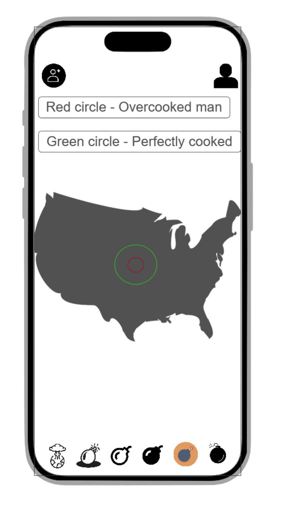

# NuclearPizza

## ⚛️💣 Specification Deliverable

- [x] Proper use of Markdown
- [x] A concise and compelling elevator pitch
- [x] Description of key features
- [x] Description of how you will use each technology
- [x] One or more rough sketches of your application. Images must be embedded in this file using Markdown image references.

## ⚡🌐 HTML deliverable

For this deliverable I added the html framework of the website and added placeholders of future features

- [x] **HTML pages** - Three HTML pages allowing you to login, use the map, and see your friends
- [x] **Links** - Every page has links to navigate to the other 2 pages for ease of use right now, eventually youll have to login to access the other 2
- [x] **Text** - There is extensive text showing off the different bomb choices
- [x] **Images** - Used a website to convert an image to svg? If that's not cool I dont blame you for docking me this one
- [x] **DB/Login** - Login boxes included as well as friendslist and highest pizza count
- [x] **WebSocket** - Displays friends scores and allows you to add friends with codes

## CSS deliverable

For this deliverable I properly styled the application into its final appearance.

- [x] **Header, footer, and main content body**
- [x] **Navigation elements** - I made a navigation bar with modern buttons
- [x] **Responsive to window resizing** - The app resizes to fit screens
- [x] **Application elements** - Used good contrast and whitespace
- [x] **Application text content** - Consistent fonts
- [x] **Application images** - Added images for the different bomb options

### Elevator Pitch  

Have you ever wanted to know how far a away a nuclear bomb needs to be dropped to perfectly cook that frozen pizza sitting in your freezer? No? Well,,, anyways. Now you get to know. Drop bombs on a map to see where you can head for those cooked pizza's and see where your friends are dropping bombs.

### Key Features  

- Login, logout, create account
- Friend accounts
- Pick locations on a map and see areas with likelihoods of properly cooked pizzas
- See friends locations' they picked  

### Technologies  

HTML - Uses correct HTML structure for application. Two HTML pages. One for login and one for displaying the map  

CSS - Application styling making the UI simple but easily undrstandable.  

React - Provides login, allows map location selection and moving around the map  

Service - Backend service with endpoints for:

- Submit friend accounts
- retrieve friend account
- submitting drop points  
- retrieving drop points  

DB/Login - Store users and drop points in database. Register and login users to link with friends.  

WebSocket - As you pick drop locations your friends can see them.

### Real rough Sketch

